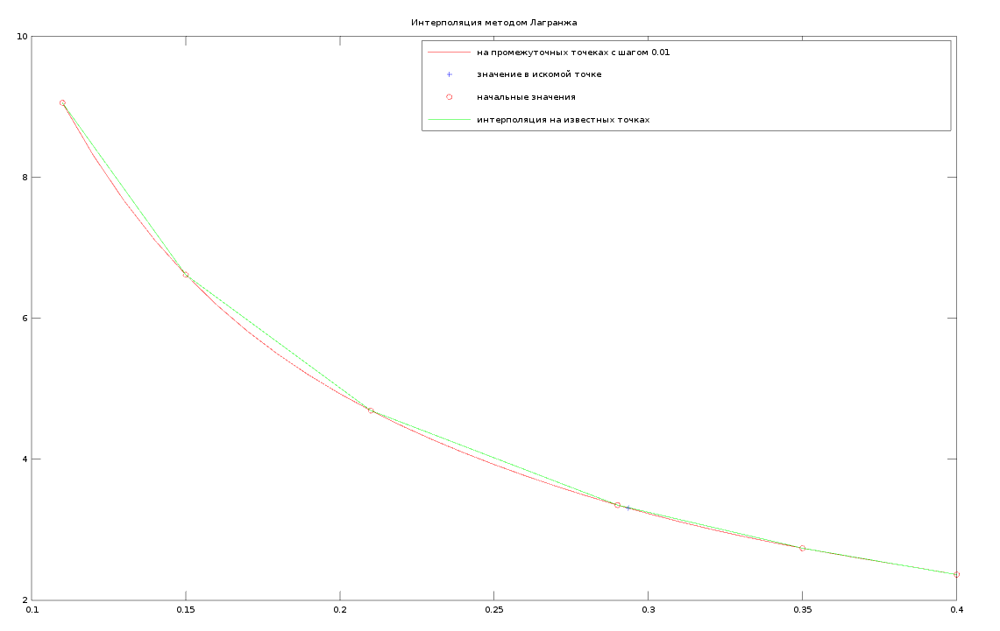
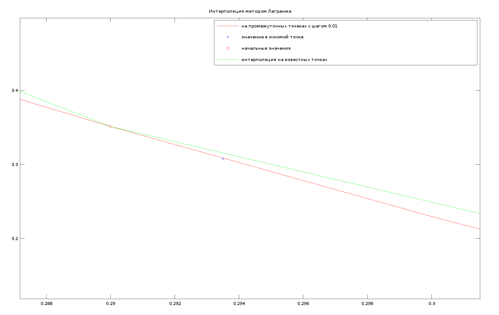
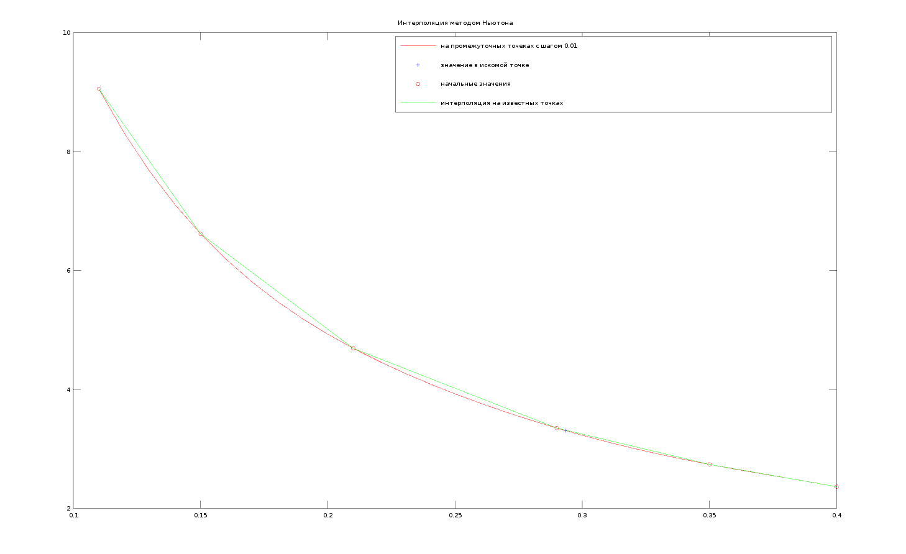
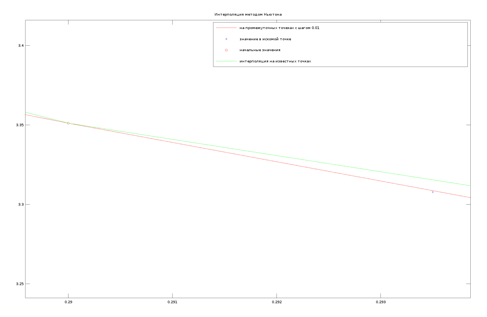
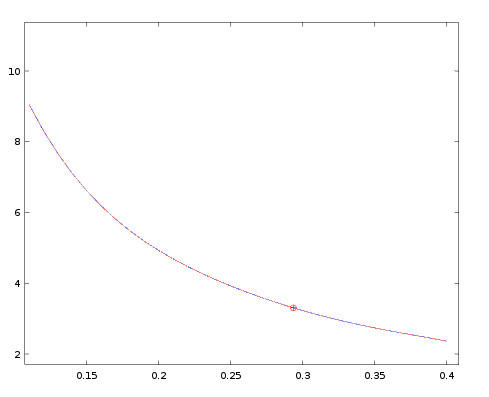
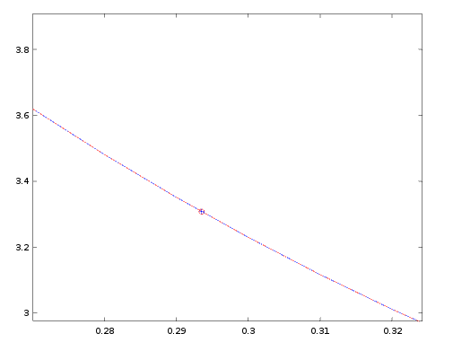
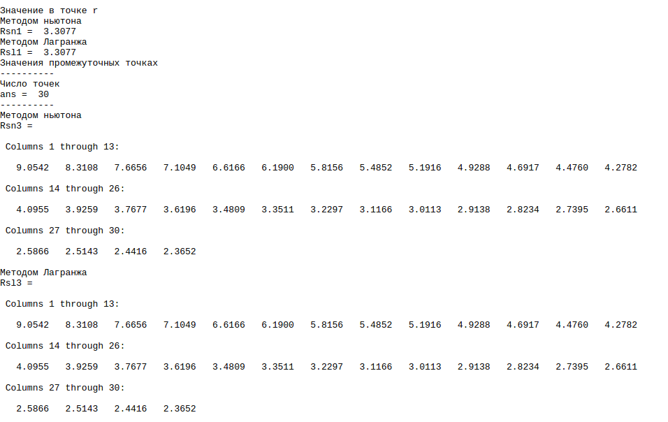

#Лабораторная работа №1 "Приближение значения таблично заданной функции в точке с помощью интерполяционных многочленов"

 
**Все файлы должны находиться в одной папке!!**

* **base.m** - скрипт для запуска расчета интерполяции двумя методами 
* **lagrange.m** - функция для расчета методом Лагранжа
* **newton.m** - функция для расчета методом Ньютона
* **plot_for_lagrange.m** - постройка графика для метода Лагранжа
* **plot_for_newton.m** - постройка графика для метода Ньютона
* **plot_for_newton_and_lagrange.m** - построка графика методоми Лагранжа и Ньютона
 *** 
1. [Интерполяционный многочлен Лагранжа](https://ru.wikipedia.org/wiki/%D0%98%D0%BD%D1%82%D0%B5%D1%80%D0%BF%D0%BE%D0%BB%D1%8F%D1%86%D0%B8%D0%BE%D0%BD%D0%BD%D1%8B%D0%B9_%D0%BC%D0%BD%D0%BE%D0%B3%D0%BE%D1%87%D0%BB%D0%B5%D0%BD_%D0%9B%D0%B0%D0%B3%D1%80%D0%B0%D0%BD%D0%B6%D0%B0)
2.  [Интерполяционные формулы Ньютона ( в примере используется первая интерполяционная формула)](https://ru.wikipedia.org/wiki/%D0%98%D0%BD%D1%82%D0%B5%D1%80%D0%BF%D0%BE%D0%BB%D1%8F%D1%86%D0%B8%D0%BE%D0%BD%D0%BD%D1%8B%D0%B5_%D1%84%D0%BE%D1%80%D0%BC%D1%83%D0%BB%D1%8B_%D0%9D%D1%8C%D1%8E%D1%82%D0%BE%D0%BD%D0%B0)
3. [Ответы на вопросы к лабе](https://github.com/mr8bit/Numerical-Methods/blob/master/Laboratory%20work%201/QUESTION.md) 

***

##Графики
###Лагранжа
  
	
В легенде графика все описано 
	

  

Можно заметить, что требуемая точка находиться практически  на линии промежуточных точек созданных нами ( xi ) 

###Ньютона
 

График достаточно похож на график методом Лагранжа

 

Так же как и на графике Лагранжа наша требуемая точка находиться практически   на линии промежуточных точек созданных нами 

###Сравнение Ньютона и Лагранжа

 

На графике заметно, что линии Лагранжа и Ньютона обсалютно идентичны 
 
Равна как и точки 

Так и есть значения высчитанные двумя методами обсалютно идентичны 

 

