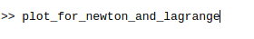

# Numerical-Methods
Лабораторные работы по Численным методом. Выполненные в Octave (Matlab совместимые)

В этом репозитории будут нахоидиться все лабораторные работы по Численным Методам за 1 семестр обучения.

* [Лабораторная работа №1 "Приближение значения таблично заданной функции в точке с помощью интерполяционных многочленов"](https://github.com/mr8bit/Numerical-Methods/tree/master/Laboratory%20work%201)

***
###Как запустить все

1. В Matlab должна быть открыта папка с лабой
2. Для вызова скрипта просто проишите его название

 

3. Нажмите Enter
4. Наслаждайтесь 
***
